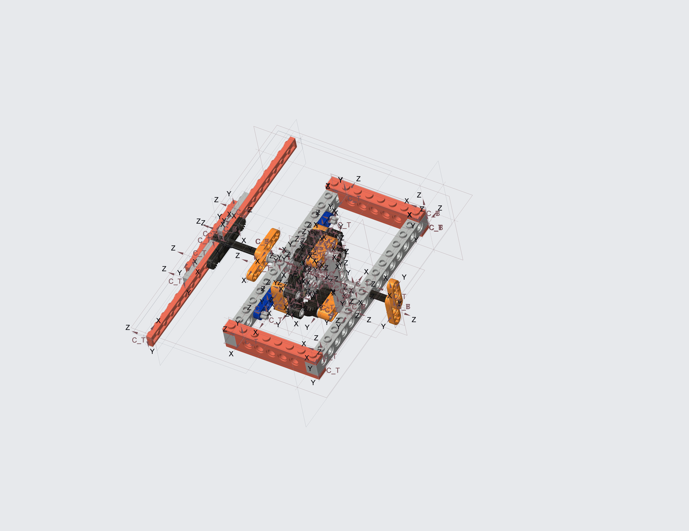

[![CC By 4.0][image]][hyperlink]
  [hyperlink]: http://creativecommons.org/licenses/by/4.0/
  [image]: https://i.creativecommons.org/l/by/4.0/88x31.png
  
# lego-planetary-gear
This repo holds a Lego Technic planetary gear designed in PTC Creo.

The custom annular gear part is inspired by http://www.thingiverse.com/thing:1257736 done by [projunk](https://www.thingiverse.com/projunk/about) is licensed under the [Creative Commons - Attribution license 3.0](http://creativecommons.org/licenses/by/3.0/).
